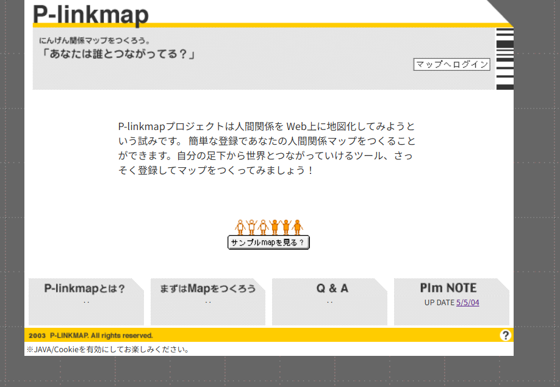
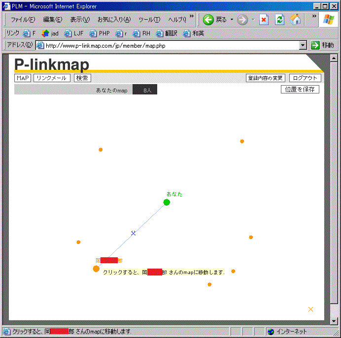

# p-linkmap

人間関係をWeb上に地図化してみようという試み。2002年頃に制作。友人のアイデアを技術面でサポートする形で開発に参加。

Javaアプレットで人物アイコンをグラフィカルに配置し、クリックで関係を芋づる式にたどれるSNS黎明期のシステム。

---

## スクリーンショット

### トップページ


> 「あなたは誰とつながってる？」― 当時のキャッチコピー。JAVA/Cookie有効が利用条件だった。

### マップ画面（Java Applet）


> Internet Explorer + Java Applet で動作。中心の緑アイコンが自分、オレンジアイコンが繋がりのあるメンバー。クリックするとそのメンバーのマップに移動できる。ブラウザのタイトルバーに "Microsoft Internet Explorer" と見える時代の記録。

---

## システム概要

- **会員登録・認証**: PHPLib を使ったセッション管理・ログイン
- **リンク登録**: 「紹介者 → 被紹介者」の有向グラフ構造で人間関係を登録
- **関係マップ表示**: Java Applet がブラウザ上でインタラクティブなグラフを描画
- **検索**: 都道府県・キーワードで会員検索
- **バッチ処理**: Perl / Shell によるメールマガジン等の定期処理

### 構成

| 層 | 技術 |
|---|---|
| フロントエンド | Java Applet (AWT) |
| Web層 | PHP + PHPLib（ページコントローラパターン） |
| DB抽象化 | PHPLib db_handler（MySQL / PostgreSQL 等マルチDB対応） |
| バッチ | Perl / Shell |

### 通信プロトコル（Applet ↔ PHP）

XMLでもJSONでもない独自テキスト形式。`<セクションタグ>` + タブ区切りキー・バリューを1行ずつ読み込む。

```
<STATUS>
code	TRUE
message	
</STATUS>
<USERINFO>
name	田中太郎
sex	M
prefectures	東京都
</USERINFO>
<ICONLIST>
（タブ区切りのアイコンデータ行）
</ICONLIST>
```

エンコーディングは Shift-JIS。HTTP GET で平文テキストを返す、当時としてシンプルで合理的な設計。

---

## 技術年表：p-linkmapが生まれた時代

Web技術の世代ごとの進化と、このシステムの立ち位置。

| 世代 | SNS / サービス | UIリッチクライアント | 通信プロトコル | サーバー側 |
|:---:|---|---|---|---|
| **~2002年** | 個人サイト・掲示板(2ch等)・リンク集文化。「SNS」という概念なし | **Java Applet** / Flash黎明期 | **独自テキスト形式**（タブ区切り・CSV等）、HTTP GET | CGI / PHP手続き型 / PHPLib。ページコントローラパターン |
| **~2007年** | Friendster(2002)・MySpace(2003)・**mixi(2004)**・GREE(2004)・Facebook(2004)。SNSという言葉が定着 | **Flash / Flex** 全盛。RIAブーム | **XML-RPC / SOAP**。Ajaxブーム（XMLHttpRequest） | **Struts** / Spring MVC / Ruby on Rails(2004)。フロントコントローラパターン確立 |
| **~2012年** | Twitter(2006)・iPhone(2007)でモバイルSNS爆発。実名SNSへ | **HTML5 Canvas** / jQuery。Adobe AIR。Flash終焉へ | **JSON** 台頭。REST API 普及 | CakePHP / Symfony / Django。ORM一般化 |
| **~2017年** | LINE(2011)・Instagram。UGCからメッセージングへ | **React / Angular / Vue**。SPA全盛 | **JSON API** / GraphQL(2015) | Node.js / Laravel。マイクロサービス |
| **~2022年** | TikTok・短尺動画。SNS飽和・分散化(Mastodon等) | **React + TypeScript** / PWA / WebAssembly | **gRPC** / tRPC。型安全・スキーマファースト | Next.js / Vercel。クラウドネイティブ・サーバーレス |
| **2023年〜** | AI統合SNS・生成AIによるコンテンツ爆増 | **RSC(React Server Components)** / LLM UI | **Streaming(SSE)** / GraphQL Subscriptions / gRPC | LLMバックエンド統合。エッジコンピューティング |

### ★ p-linkmap の位置

```
2002年 ── SNS    : mixiの2年前。「人の繋がりを可視化する」発想はSNSと同時期・同動機
          UI     : Java Applet（現在はブラウザプラグイン削除済み・完全絶滅）
          通信   : 独自タブ区切りテキスト（JSON以前・XML以前の独自プロトコル）
          サーバー: PHP + PHPLib（フレームワーク以前・手続き型PHP）
```

**発想は正しかったが、実装レイヤーがほぼすべて時代に置き換えられた。**  
同じ機能を今作るなら： React Flow / Cytoscape.js（グラフ描画）+ REST JSON API + Next.js、といった構成になる。

---

